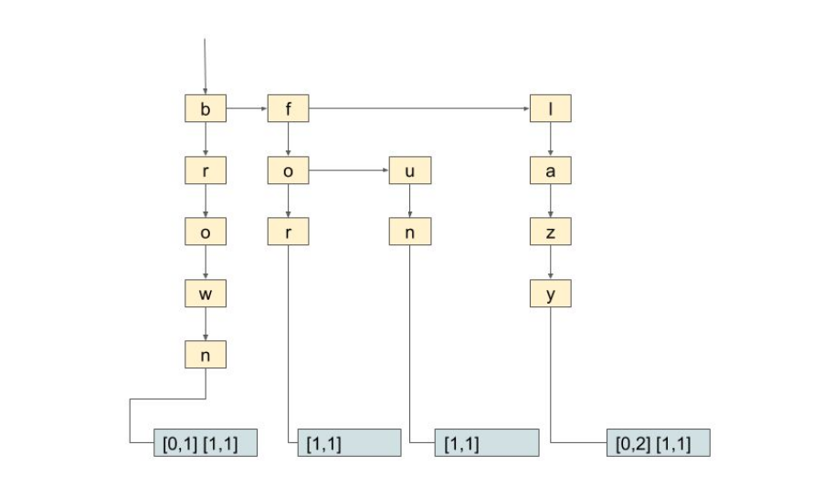
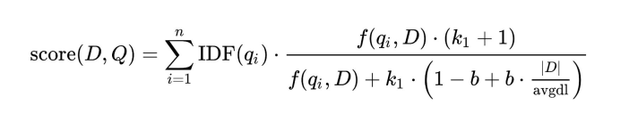
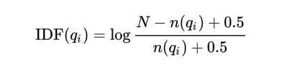

# Mini-Search-Engine


### Table of Contents

[Introduction](#introduction)

[Inputs](#inputs)

[Data structures](#data_structures)

[Relevance score](#relevance_score)

[Application interface](#app_interface)


<a name="introduction"/>

## Introduction

This project implements a mini search engine. The implemented data structures and the approach followed is a very simplified form of the infrastructure that the search engines, like Google or Bing, use. More specifically, the application uses an [inverted index](https://en.wikipedia.org/wiki/Inverted_index) to efficiently store a set of text documents and is able to answer to *keyword queries*, returning the *top-k* (most relevant to the query) documents to the user.

The project has been developed using **C++** *(without STL)* and **Object Oriented Programming practices**.


<a name="inputs"/>

## Inputs

The ***docfile*** (or any other file name) is a file that includes all the documents that the application saves and processes.   
Each line of this file is a document with words. For example, if the contents of the file are:
```
0 The quick brown fox leaped over the lazy lazy dog
1 Quick brown foxes leaped over lazy dogs for fun
```
It means that there are two documents, one for each line. The first word in each line is the ID of the specific document. 

There are some demo datasets provided (in the [datasets folder](./datasets)), as well as some queries (in the [queries folder](./queries)) for them and their corresponding results (in the [results folder](./results)).

> The document IDs must be given in order (starting from 0). An appropriate check is performed and in the case that an error is found the application is terminated.


<a name="data_structures"/>

## Data structures

- A **dynamically allocated array** that stores all the text documents. It is used as a map, mapping *<doc_IDs>* to documents' text (standard array indexing is used for document identification).

    | docID |   text |
    | :----: | :----: |
    |  0     | The quick brown fox leaped over the lazy lazy dog    |
    | 1      | Quick brown foxes leaped over lazy dogs for fun |
    | ...    | ... |

- The **inverted index** is essentially a matching of every word in the documents collection to these documents. 
For example, for the two texts above, a part of the inverted index is represented as follows:

    | word  |  [ *<doc_ID>*, *<word_freq>*] |
    | :----:| :------------:|
    | brown | [0, 1] [1, 1] |
    | lazy  | [0, 2] [1, 1] |
    | for   | [1, 1]        |
    | fun   | [1, 1]        |
    | ...   | ...           |

    On the left side there is the key (every word), while on the right side there is a list of document IDs, as well as how many times each word appears in each document. This list is called a *postings list*. For example, the word *"lazy"* appears twice in document 0 ( thus [ 0, 2 ] ) and once in document 1.   

- A [**Trie**](https://en.wikipedia.org/wiki/Trie) is used in order to efficiently find the *postings lists* and thus achieve fast searches in the index. It stores the documents' words. In its
leaves each posting list is included. For example, in the following figure, a part of the Trie and postings lists is depicted.




<a name="relevance_score"/>

## Relevance score

Given a query *(e.g. brown fun)*, the answer is calculated as follows:   
For each word, the posting list from Trie is found. In the particular example ```[0,1] [1,1] and [1,1]``` respectively.   
For each document ID *D* that appears in either one list or the other, the relevance
of this particular document to the query *(i.e. its relevance score)* is calculated, using the
[BM25](https://en.wikipedia.org/wiki/Okapi_BM25) type:



- ***qi*** ​: a word part of the query.
- ***f(qi, D)​*** : the *qi's* term frequency in the document.
- ***​|D|*** ​: the number of document's words.
- ***avgdl***​ : the average number of words from all the documents in the index.
- ***k1, b*** : the parameters that allow us to optimize the search engine *(default values: ```k1 = 1.2, b = 0.75```)*.
- ***IDF(qi)*** : the *inverse document frequency* (it represents in how many texts the word *qi* exists) and is calculated as follows:
 
    

  - ***N*** : the number of documents in the index.
  - ***n(qi)*** : the number of documents that contain the word *qi*.

After calculating the score for each document the *K* higher scores are found and the
corresponding documents are presented to the user.


<a name="app_interface"/>

## Application interface

A makefile is provided. You can use the command ```$ make``` for easy compilation and ```$ make clean``` to delete all **.o* auto generated files.

To run the application use the command:   
```$ ./minisearch -i <docfile> -k <K>```

### Command line arguments 

- ***-k*** : indicates how many results the application returns for each query.   
e.g. For ```K=5``` the application will return 5 results (at most) for each query. If a query has less than, K will only return these.
- ***-i*** : the input file name *(docfile by default)*.


### Application commands

When the application finishes creating the index, it will wait for the user's input. The user will be able to give the following commands:

- ```/search q1 q2 q3 q4 ... q10```: The user searches for documents that contain one or more of the *qi* words after the command keyword. These words consist the query. For example, for the command ```/search brown lazy``` both of the above demo documents are returned. The command expects at least one word and at most 10.
If more than 10 words are given, only the first 10 are used. Once the command ```/search``` is given,
the application finds the documents that contain the words, calculates a score based on how relevant
each document is with the query, sorts these documents based on this *relevance score* and prints the *top-K*. 

    The user sees on his screen the serial number of the result, the ID of the document, the relevance score, the document, as well as where the query words are located in the document. More specifically for the query ```/search brown lazy``` for the two documents above, the user will see the following:

    ```
    /search brown lazy
    1.( 1)[0.0341] Quick brown foxes leaped over lazy dogs for fun
                         ^^^^^                   ^^^^
    2.( 0)[0.0320] The quick brown fox leaped over the lazy lazy dog
                             ^^^^^                     ^^^^ ^^^^
    ```

- ```/df```: The document frequency vector is printed, i.e. each word from the input file along with the number of documents in which it appears. In the example of the two documents above, the following will appear:
    ```
    /df
    the 1
    quick 1
    over 2
    leaped 2
    lazy 2
    fun 1
    foxes 1
    fox 1
    for 1
    dogs 1
    dog 1
    brown 2
    The 1
    Quick 1
    ```

    > If there is a word after the command, then the document frequency is printed only for the particular word. For example:    
    ```
    /df leaped
    leaped 2
    ```

- ```/tf id q_word```: Prints the term frequency for the particular word in the particular document, i.e. how many times the word *"q_word"* appears in the document with the given ID. For example:
    ```
    /tf 0 lazy
    0 lazy 2
    ```

- ```/exit```: Τhe application terminates.
